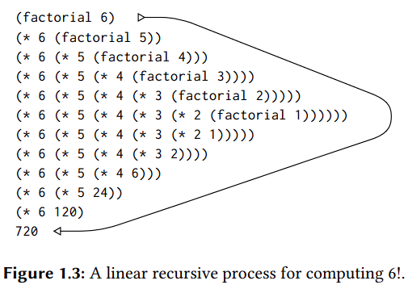
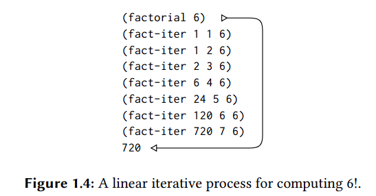
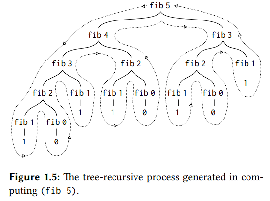

# CH 1: Building Abstractions with Procedures

## 1.1 Elements of Programming

Combinations
- list of expressions and operators within parenthesis
- combination result obtained by 
  - applying procedure specified by the operator to the arguments 
  - Ex: `(+ 21 35 12 7}`

Name
- variables
- Ex: `(define size 2)`
- Ex: `(define circumference (* 2 pi radius))`

Environment
- memory maintained by the interpreter that associates values with symbols (variables) for later retrieval

Combination Evaluations
- 1. Evaluate each sub-combination inside of combination
  - repeated evaluations of sub-items results in primitive expressions
  - primitive expressions evaluation rules:
    - values of numbers = numbers they name
    - values of operators = machine instruction sequences they represent
    - values of names = objects associated with those names 
  - does not handle *special forms* (ex: `define`)
- 2. Apply the procedure (operator) to the resulting values from step 1
- Note: this is referred to applicative-order evaluation

Compound procedure (aka procedure definition)
- Ex: `(define (square x) (* x x))`

```scm
(define ((name) (formal parameters))
  (body))

  ; name              -> function name
  ; formal parameters -> function args
  ; body              -> expression that yields value of procedure 
```

Substitution Model
- applies to combination whose operator names a compound procedure
- the compound procedure has its parameters replaced by the elements in the combination
- the "substitution" where arguments are applied to compound procedure, is done using local environment for the formal parameters of the compound procedure

Applicative-order vs Normal-order evaluation
- see page 20
- applicative-order evaluation
  - where args are evaluated first and then applied
  - is more efficient and used by Lisp
- normal-order evaluation
  - where operand expressions are substituted for parameters until an expression involving only primitive operators is reached; only then things would be evaluated
  - so rather than evaluating expressions, you pass them into the functions and continue until you reach the end, and then evaluate everything
  - aka "fully expand and then reduce"
  - can result in multiple, repeated evaluations

Case-analysis
- its like if statement
- General form of conditional expression
  - where `cond` is followed by parenthesized pair of expressions `p` and `e` which are clauses
  - the `p` or first expression in the clause is the predicate, which is an expression that is evaluated as either true `#t` or false `#f`
  - the `e` is consequent and is the value of `cond` expression if `p` is true
  - `p1` is evaluated first, and if false then `p2` is evaluated, and so on until a predicate is found whose value is true, and the corresponding consquent expression `e` is returned as the value of the conditional expression
    - if none of the predicates are found to be true, then value of `cond` expression is undefined
    ```scm
    (cond ((p1) (e1))
        ((p2) (e2))
        ...
        ((pn) (en)))
    ```
- Ex:
    ```
    (define (abs x)
    (cond ((> x 0) x)
            ((= x 0) 0)
            ((< x 0) (-x))))
    ```

Predicate
- is also used for procedures that return true or false
- When checking predicate's value, `#f` is evaluated as false and any other value is treated as true `#t`
- primitive predicates: `<`, `=`, `>`
- written with question mark (ex: `good-enough?`) as a stylistic practice to help denote it is a predicate

`else`
- special symbol that can be used in place of the final `p` clause of a `cond` expression
- causes `cond` to return the `else` clause as its value whenever all previous clauses have been bypassed
- Ex:
    ```
    (define (abs x)
    (cond ((< x 0) (- x))
            (else x)))
    ```

`if`
- special form
- restricted type of conditional that can be used when there are precisely two cases in the case analysis
- General form: `(if (predicate) (consequent) (alternative))`
- first the predicate is evaluated, and if results in true then evaluates the consequent and returns its values otherwise it evaluates alternative and returns that value
- difference between `cond` expressions with `else` is that unlike with `else`, `if` expressions require that the consequent and alternative  be single expressions
- Ex:
    ```
    (define (abs x)
    (if (< x 0)
        (- x)
        x))
    ```
 
Logical Composition Operations
- see page 25
- enables for constructing compound predicates
- `(and (e1) ...(en))`
  - each `e` expression is evaluated one at a time in left-to-right order
  - if any `e` evaluates to false, then the value of the `and` expression is false and the rest of the `e` are not evaluated
  - if all `e` expressions are evaluated as true, then the `and` expression results in the value of the last one
- `(or (e1) ...(en))`
  - `e` expressions are evaluated one at a time, left-to-right order
  - if any `e` evaluates to true, then its value is returned as the value of the `or` expression and the rest of the `e` expressions are not evaluated
  - if all `e` expressions evaluate to false, the value of `or` expression is false
- `(not (e))`
  - where value of `not` expression is true when `e` evaluates to false, and value is false otherwise
- the reason why for `and` and `or` not all subexpressions are evaluated (per applicative-order) is because they are special forms, not procedures

Difference b/w mathematical functions and procedures
- functions often describe the properties of things and is _declarative_ (what is)
- procedures often describe how to do things and is _imperative_ (how to)

Rational number
- divisions between integers can result in a rational number (ex: 5/3) instead of a decimal
- to have result be decimal, need to use decimal numbers in the argument

Bound variable
- refers to the formal parameter of a procedure
- free variables are not bound to procedures
- a bound variable's name does not matter can be renamed 
- ex: for function "good-enough?", `guess` and `x` would be bound variables and `<` `-`, `abs`, and `square` are free variables


Scope
- set of expressions for which a binding defines a name 
- for procedures, bound variables declared as formal parameters have the body of the procedure as their scope

Block structure
- where you nest definitions (functions) within a root definition (function)
- allows you to define functions without causing naming collisions in the environment (since the nested definitions are local to the root definition)

Lexical Scoping
- where argument from outer definition can be used in enclosing, nested definitions
- free variables in procedure are taken to refer to bindings made by enclosing procedure definitions
  - by refer, it means the bindings are looked up in the environment in which the procedure was defined
- Ex: `sqrt` definition has many nested definitions that use arg `x`; instead of redeclaring this `x` for each nested definition, just invoke `x` from the nested procedure bodies and get `x` from the enclosing `sqrt` definition where `x` is first defined
- Ex:

    ```scm
    (define (sqrt x)
        (define (good-enough? guess)
            (< (abs (- (square guess) x)) 0.001))
        (define (improve guess)
            (average guess (/ x guess)))
        (define (sqrt-iter guess)
            (if (good-enough? guess)
                guess
                (sqrt-iter (improve guess))))
        (sqrt-iter 1.0))
    ```

## 1.2 Procedures and Processes

Chapter Overview
- Examine common patterns or types of processes and their characteristics (such as time and space usage)

Linear Recursive Process
- Where the amount of information needed to keep track of operations in a function grows linearly with `n` input size
  - operations are deferred until you reach input size `n`
- Example:
  
  

Linear Iterative Process
- Memory-efficient process where only variables are updated with current values based on `n`, without growing the call stack without deferred operations
- Example:

  

Tree Recursion
- Can inefficient as time complexity is O(2^n), where `n` is input size (exponential)
  - space complexity is linear tho
- Example:

  

_left off on pg 53_

## 1.3 Formulating Abstractions with Higher-Order Procedures

High-Order Procedures
- Procedures that manipulate procedures
- Can accept and return procedures

Examples of using high-order procedure

```scm
;no higher-order procedure
(define (sum-integers a b)
  (if (> a b) 
      0 
      (+ a (sum-integers (+ a 1) b))))
;----------------------------------------

;higher-order procedure
(define (sum term a next b)
  (if (> a b)
      0
      (+ (term a)
         (sum term (next a) next b))))

(define (inc n) (+ n 1))

(define (identity x) x)

(define (sum-integers a b)
  (sum identity a inc b))
```